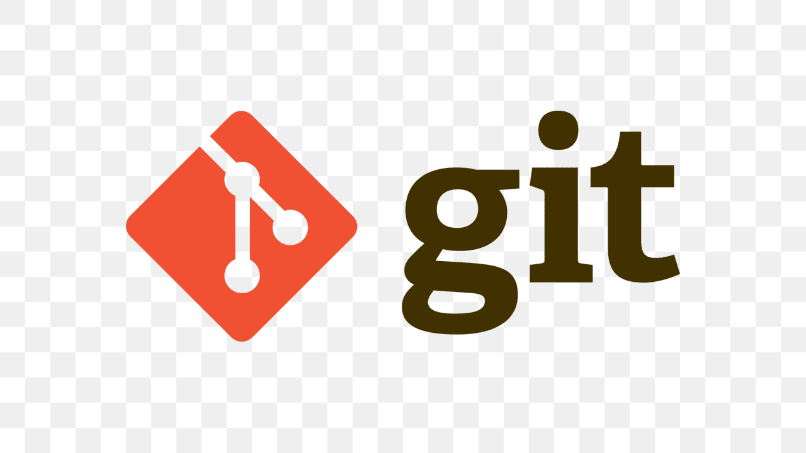
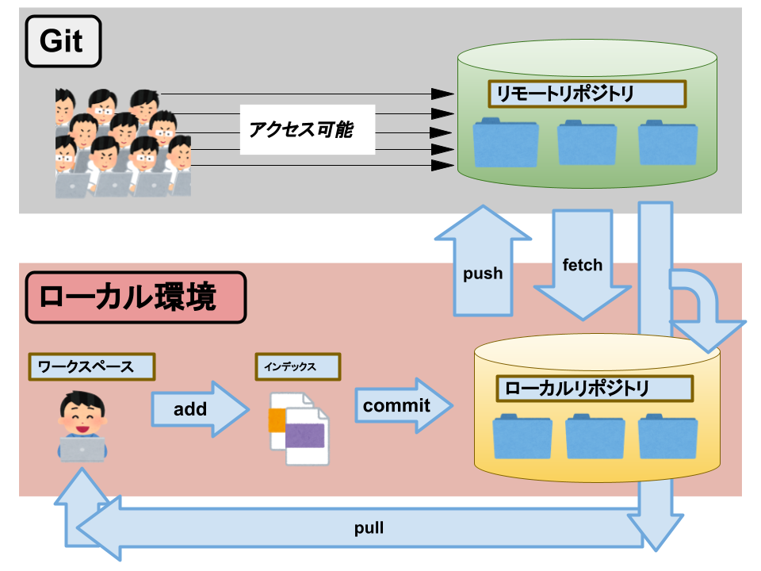
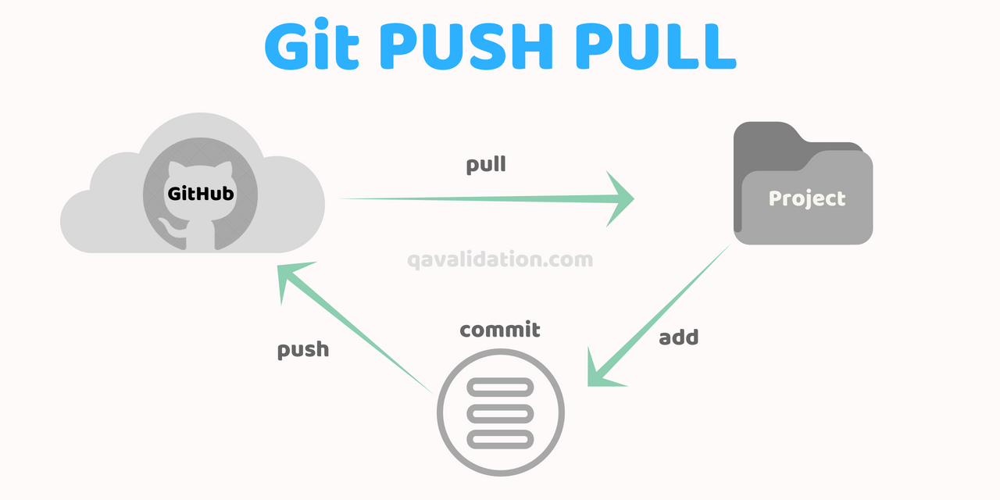
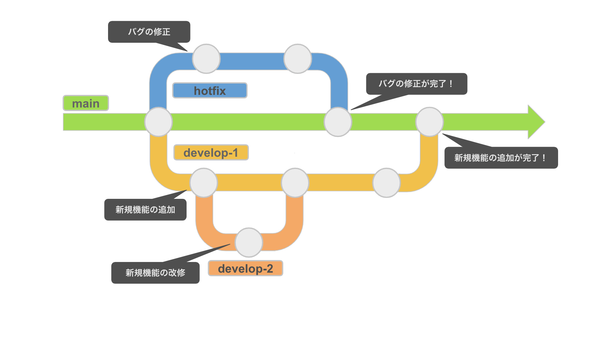

# ひろもわかるGitHub解説書
## Gitとは

- ファイルのバージョン管理を行うことができるシステム、過去の状態のファイルに戻すこともできる
## GitHubとは

- Gitのプロジェクトを管理、共有するためのウェブサービス
## GitとGitHubの違い
- Git:バージョン管理のためのツール
- GitHubはツールを使うための場所

## リポジトリとは
- プロジェクトのファイルやフォルダ、変更履歴をまとめて管理、保管する場所

## リポジトリの種類
- ローカルリポジトリ
    - 自分のパソコン内にある保管場所
- リモートリポジトリ
    - GitHubなどのインターネット上の保管場所
- 
## コミットとは
- 作業の変更を記録する
    - 定期的にコミットしておこう
## プッシュ,プルとは
- プッシュ：変更した内容をリポジトリにアップロードする
- プル：リポジトリに保存してあるの変更履歴を取り込む
- 
## ブランチとは
- プロジェクトを枝分かれさせて作業を同時変更で進めるための仕組み
- mainと呼ばれる幹から枝分かれしてそれぞれ独立して作業を進められる
- 作業が完了したら"main"ブランチに「マージ」することで反映さることができる
- 
### ブランチを使うメリット
- 複数人で作業するとき未完成の機能がソースコードに影響しないので安全に作業を進められる
### 大友内装からの伝言
- mainブランチにプッシュしたら〇す
### 

