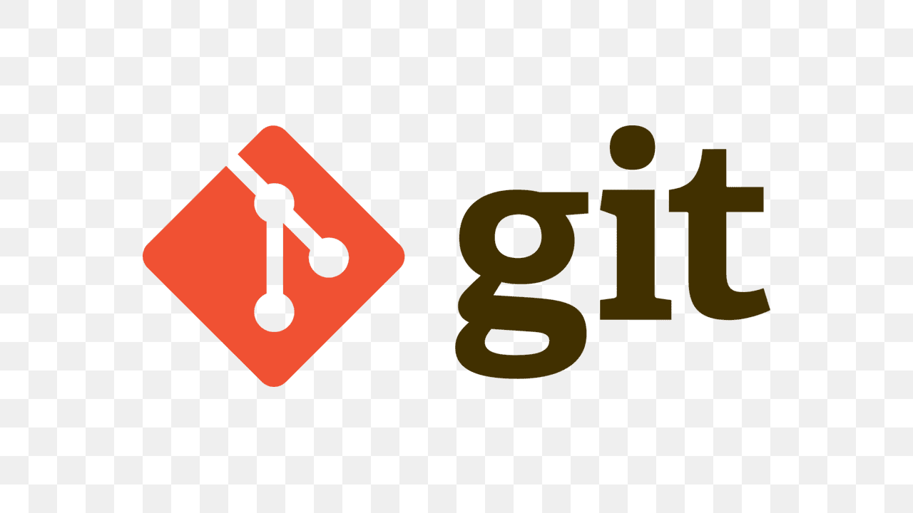
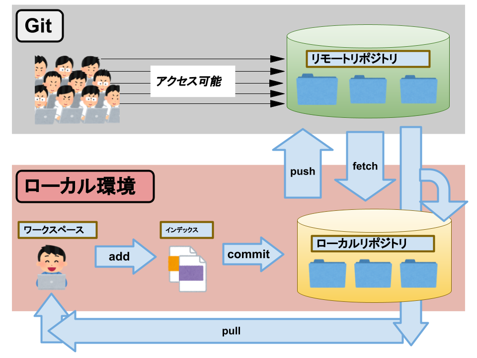
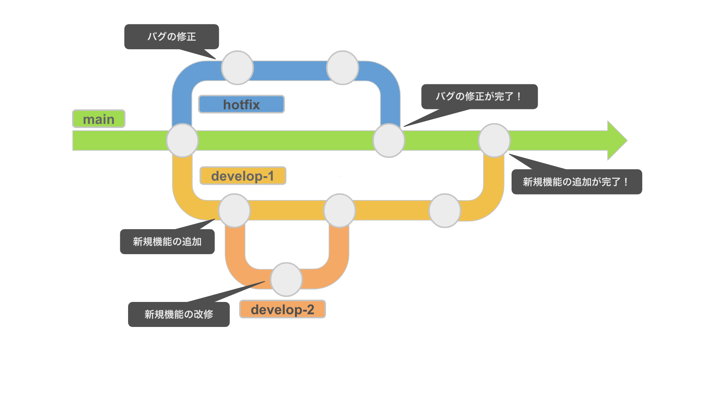

# オブジェクト指向言語とは
## オブジェクト指向とは
- プログラムを役割を与えられたものとして構築する

    - それそれの機能（剣、銃、敵）ごとに分ける 
- データとデータを処理する機能（メソッド）を一つにまとめた単位をオブジェクトいう
# オブジェクト指向の三大原則
## カプセル化
- データと処理を1つの単位にまとめ、外部からの直接的なアクセスを制限すること

### カプセル化のメリット
- オブジェクトの内部状態を外部から守れる
- 実装の変更が外部に影響しにくくなる
## 継承
- 既存のクラス（親クラス）を新しいクラス（子クラス）に引き継ぐ

### 継承のメリット
- コードの重複を減らせる
- 親クラスに共通の処理をまとめることで、親クラスを修正するだけでデバッグできる
## ポリモーフィズム
- 同じメソッド名だが、異なるオブジェクトが異なる処理をすること

- 継承やインターフェースを利用して、共通のインターフェースで異なる実装を提供できる
    - 柔軟性が高い
### ポリモーフィズムのメリット
- 共通のインターフェースで処理できるため、コードがシンプルになる
- 実装の詳細を気にすることなく処理をかける
# solid原則
## solid原則とは
- ソフトウェア開発時に従うべきガイドライン
- 拡張性、保守性を高めるためのもの
## S(Single Responsibility)単一責任の原則
- クラスに多くの責任があるとバグが発生する恐れがある
  - 変更したときに、ほかの責任に影響を与える可能性がある
- 
## O(Open-Closed)オープン・クローズドの原則
- クラスの動作を変更すると、そのクラスを使うシステム全体に影響する
  - より多くの関数を実行したいときは既存の関数に追加する（変更しない）
- 
## L(Liskov Substitution)
- 子クラスが親クラスと同じ動作ができない場合、バグになる可能性がある
子クラスは親クラスの動作をすべてできる必要がある（継承）
## I(Interface Segregation) インターフェイス分離の原則
- クラスに使用しない動作を実行させようとするのは無駄が多く、バグにつながる
  - クラスは必要な動作のみを実行する必要がある（それ以外は削除or別の場所に移す）
## D(Dependency Inversion) 依存性逆転の原則
- クラスは動作を実行するために使用するツールと融合するべきではない
- クラスに接続できるようにするインターフェイスと融合するのがよい
# 自分の環境（react）での作法
## １つのコンポーネントには１つの役割を持たせる
- １つのコンポーネントにs責務は一つ
- 再利用しやすくする
- <悪い例>
- 
- <よい例>
- 

## 関数コンポーネント＋hooksを使う
- クラスコンポーネントより関数コンポーネントが主流
- 状態管理はuseState,useEffectで行う
