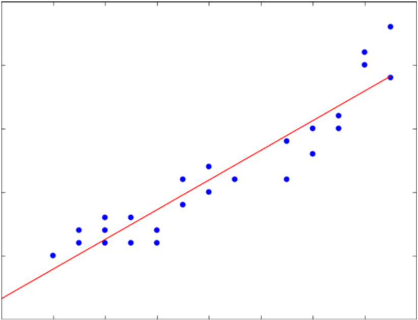

# 線形解析とは
線形解析は、変数同士が直線的にある関係の場合、例えば、足し算や引き算もような単純な式で表せる状況で使われる。

## 特徴
前述したように数式が単純なので計算が速く、モデルがシンプルになる。また人間が結果を理解しやすい点も強みである。しかし、複雑な問題には対応できない

## 向いているケース
- 温度が1度上がるごとに消費電力が一定量増える→関係が比例的な時
- データ量が少ない or 特徴量が少ない

# 非線形解析とは
非線形解析は線形解析とは対照的に、変数同士の関係が複雑に変化する場合に使われる。

## 特徴
数学的に複雑な式（掛け算、指定関数、対数関数などを含む）で解を直接求めることが困難。その分高精度になりやすいが、学習スピードが遅く、人間が結果を理解しにくい。

## 向いているケース
- ある温度までは使わないが、そこを超えると急にエアコン使用が増える→特徴量と変数の関係が複雑
- 特徴量の相互作用や重要度を自動で学習したい
- 精度の高さを重視するとき

    
 